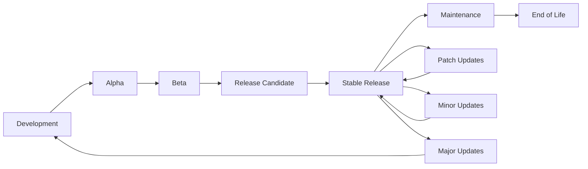

# Versions Directory

## Overview
The `versions/` directory contains versioned releases, snapshots, and historical versions of DataScribe. This directory serves as a version control system for tracking project evolution, maintaining backward compatibility, and providing access to previous stable releases.

## 📁 Contents

### `v1.0.0/`
**Version 1.0.0 - Core MVP Release**

First stable release with core functionality:
- **`datascribe-v1.0.0.zip`**: Complete application package
- **`release-notes.md`**: Detailed release notes and changelog
- **`migration-guide.md`**: Migration guide from previous versions
- **`api-changes.md`**: API changes and deprecation notices
- **`performance-benchmarks.md`**: Performance metrics and benchmarks
- **`known-issues.md`**: Known issues and workarounds

### `v1.1.0/`
**Version 1.1.0 - Enhancement Release**

Feature enhancements and improvements:
- **`datascribe-v1.1.0.zip`**: Enhanced application package
- **`new-features.md`**: New feature documentation
- **`improvements.md`**: Performance and usability improvements
- **`bug-fixes.md`**: Bug fixes and issue resolutions
- **`compatibility.md`**: Compatibility information

### `v1.2.0/`
**Version 1.2.0 - Advanced Features Release**

Advanced functionality and enterprise features:
- **`datascribe-v1.2.0.zip`**: Advanced feature package
- **`enterprise-features.md`**: Enterprise-level features
- **`security-updates.md`**: Security enhancements
- **`scalability.md`**: Scalability improvements
- **`integration-guide.md`**: Third-party integration guide

### `v2.0.0/`
**Version 2.0.0 - Major Release**

Major version with significant changes:
- **`datascribe-v2.0.0.zip`**: Major version package
- **`breaking-changes.md`**: Breaking changes documentation
- **`upgrade-guide.md`**: Comprehensive upgrade guide
- **`architecture-changes.md`**: Architecture and design changes
- **`feature-comparison.md`**: Feature comparison with v1.x

### `snapshots/`
**Development Snapshots**

Pre-release development versions:
- **`nightly/`**: Daily development builds
- **`beta/`**: Beta testing versions
- **`rc/`**: Release candidate versions
- **`dev/`**: Development branch snapshots

### `archived/`
**Archived Versions**

Deprecated and archived versions:
- **`legacy/`**: Legacy version support
- **`deprecated/`**: Deprecated functionality
- **`experimental/`**: Experimental features
- **`research/`**: Research and prototype versions

## 🔄 Version Management

### Semantic Versioning
**Version Numbering Scheme**

DataScribe follows semantic versioning (SemVer):
```
MAJOR.MINOR.PATCH[-PRERELEASE][+BUILD]
```

**Examples:**
- **v1.0.0**: First stable release
- **v1.1.0**: New features, backward compatible
- **v1.1.1**: Bug fixes, backward compatible
- **v2.0.0**: Breaking changes, major version
- **v1.2.0-beta**: Pre-release beta version

### Version Lifecycle
**Release Management Process**



## 📦 Release Packages

### Package Structure
**Standard Release Package**

```
datascribe-v1.0.0/
├── datascribe-v1.0.0.zip          # Main application package
├── datascribe-v1.0.0.tar.gz       # Alternative archive format
├── datascribe-v1.0.0.exe          # Windows installer (if applicable)
├── datascribe-v1.0.0.dmg          # macOS installer (if applicable)
├── datascribe-v1.0.0.deb          # Debian/Ubuntu package
├── datascribe-v1.0.0.rpm          # RHEL/CentOS package
├── release-notes.md                # Release documentation
├── changelog.md                    # Detailed change log
├── migration-guide.md              # Migration instructions
├── api-reference.md                # API documentation
├── user-guide.md                   # User manual
├── developer-guide.md              # Developer documentation
├── deployment-guide.md             # Deployment instructions
├── examples/                       # Example datasets and scripts
├── tests/                          # Test suite
├── docs/                           # Documentation
└── licenses/                       # License files
```

### Package Contents
**What's Included in Each Release**

#### Core Application
- **Source Code**: Complete application source code
- **Dependencies**: Requirements and dependency specifications
- **Configuration**: Default configuration files
- **Templates**: Report and visualization templates
- **Static Assets**: CSS, JavaScript, and image files

#### Documentation
- **User Manual**: End-user documentation
- **API Reference**: Complete API documentation
- **Developer Guide**: Development and contribution guide
- **Deployment Guide**: Production deployment instructions
- **Migration Guide**: Version upgrade instructions

#### Examples and Tests
- **Sample Datasets**: Example data for testing
- **Example Scripts**: Usage examples and tutorials
- **Test Suite**: Comprehensive testing framework
- **Benchmarks**: Performance benchmarks and tests

## 📋 Release Notes

### Version 1.0.0 Release Notes
**Core MVP Release**

```markdown
# DataScribe v1.0.0 Release Notes

## 🎉 Release Overview
DataScribe v1.0.0 is the first stable release, providing a comprehensive automated EDA platform with core functionality for data analysis, visualization, and reporting.

## ✨ New Features

### Core EDA Engine
- **Automated Data Analysis**: Comprehensive dataset analysis
- **Data Quality Assessment**: Missing values, duplicates, outliers
- **Statistical Summaries**: Descriptive statistics and distributions
- **Univariate Analysis**: Individual column analysis
- **Bivariate Analysis**: Relationship analysis between variables
- **Multivariate Analysis**: Advanced correlation and pattern analysis

### Visualization Engine
- **Automated Plot Generation**: Publication-ready visualizations
- **Multiple Chart Types**: Histograms, scatter plots, heatmaps
- **Customizable Styling**: Professional appearance and branding
- **Export Options**: High-resolution image export

### Report Generation
- **HTML Reports**: Interactive web-based reports
- **PDF Export**: Professional PDF documentation
- **Excel Workbooks**: Structured data export
- **Custom Templates**: Branded and customized reports

### Web Interface
- **FastAPI Backend**: Modern, fast web framework
- **File Upload**: Support for CSV, Excel, Parquet
- **Job Management**: Background processing and status tracking
- **API Endpoints**: RESTful API for integration

## 🔧 Technical Specifications

### System Requirements
- **Python**: 3.8 or higher
- **Memory**: 4GB RAM minimum
- **Storage**: 2GB disk space
- **OS**: Windows 10+, macOS 10.15+, Ubuntu 18.04+

### Supported Formats
- **Input**: CSV, Excel (.xlsx, .xls), Parquet
- **Output**: HTML, PDF, Excel, Python/R code
- **Encoding**: UTF-8, ISO-8859-1, Windows-1252

### Performance
- **Dataset Size**: Up to 100MB (configurable)
- **Processing Time**: Typically 30 seconds to 5 minutes
- **Concurrent Users**: 10+ simultaneous users

## 🚀 Getting Started

### Installation
```bash
# Using pip
pip install datascribe

# Using conda
conda install -c conda-forge datascribe

# From source
git clone https://github.com/your-org/datascribe.git
cd datascribe
pip install -e .
```

### Quick Start
```python
from datascribe import DataScribe

# Initialize DataScribe
ds = DataScribe()

# Load dataset
df = pd.read_csv('your_data.csv')

# Run analysis
results = ds.analyze(df, target_col='target')

# Generate reports
ds.generate_reports(results, output_dir='reports/')
```

## 🐛 Known Issues

### Limitations
- **Large Datasets**: Processing time increases exponentially with dataset size
- **Memory Usage**: High memory consumption for datasets >50MB
- **PDF Generation**: Some complex visualizations may not render properly
- **Browser Compatibility**: IE11 not supported

### Workarounds
- **Large Datasets**: Use data sampling or chunked processing
- **Memory Issues**: Increase system memory or use cloud deployment
- **PDF Issues**: Export as HTML and convert manually
- **Browser Issues**: Use modern browsers (Chrome, Firefox, Safari, Edge)

## 🔄 Migration from Previous Versions

### Breaking Changes
- **API Changes**: Some endpoint URLs have changed
- **Configuration**: New configuration file format
- **Dependencies**: Updated Python package requirements

### Migration Steps
1. **Backup**: Backup existing data and configurations
2. **Update**: Install new version
3. **Migrate**: Run migration script
4. **Verify**: Test functionality
5. **Cleanup**: Remove old files

## 📊 Performance Benchmarks

### Test Results
- **Small Dataset (1K rows)**: 15 seconds
- **Medium Dataset (10K rows)**: 45 seconds
- **Large Dataset (100K rows)**: 3 minutes
- **Memory Usage**: 2-8GB depending on dataset size

### Optimization Tips
- **SSD Storage**: Use SSD for faster file I/O
- **Sufficient RAM**: Ensure adequate memory allocation
- **CPU Cores**: Multi-core processing for large datasets
- **Network**: Fast network for cloud deployments

## 🔮 Future Roadmap

### Version 1.1.0 (Q2 2024)
- **Performance Improvements**: 2x faster processing
- **Additional Visualizations**: More chart types
- **Enhanced Reports**: Better formatting and customization
- **API Enhancements**: More endpoints and options

### Version 1.2.0 (Q3 2024)
- **Machine Learning**: Basic ML model integration
- **Advanced Analytics**: Statistical testing and validation
- **Collaboration**: Multi-user support
- **Cloud Integration**: AWS, Azure, GCP support

### Version 2.0.0 (Q4 2024)
- **Enterprise Features**: Advanced security and compliance
- **Scalability**: Horizontal scaling and load balancing
- **Customization**: Plugin system and extensions
- **Integration**: Third-party tool integration

## 📞 Support and Community

### Getting Help
- **Documentation**: Comprehensive guides and tutorials
- **GitHub Issues**: Bug reports and feature requests
- **Discord Community**: Real-time support and discussion
- **Email Support**: Enterprise support and consulting

### Contributing
- **Code Contributions**: Pull requests and code reviews
- **Documentation**: Help improve guides and tutorials
- **Testing**: Report bugs and test new features
- **Feedback**: Share ideas and suggestions

## 📄 License

DataScribe v1.0.0 is released under the MIT License. See the LICENSE file for details.

---

**Release Date**: March 15, 2024  
**Maintainer**: DataScribe Team  
**Support**: Until March 15, 2026
```

## 🔄 Version Migration

### Migration Process
**Step-by-Step Version Upgrade**

#### Pre-Migration Checklist
1. **Backup Data**: Backup all datasets and configurations
2. **Check Compatibility**: Verify system requirements
3. **Review Changes**: Read release notes and breaking changes
4. **Test Environment**: Test upgrade in development environment
5. **Schedule Downtime**: Plan maintenance window if needed

#### Migration Steps
```bash
# 1. Stop current application
sudo systemctl stop datascribe

# 2. Backup current installation
sudo cp -r /opt/datascribe /opt/datascribe-backup-$(date +%Y%m%d)

# 3. Download new version
wget https://github.com/your-org/datascribe/releases/download/v1.1.0/datascribe-v1.1.0.zip

# 4. Extract new version
unzip datascribe-v1.1.0.zip
sudo cp -r datascribe-v1.1.0/* /opt/datascribe/

# 5. Update dependencies
cd /opt/datascribe
source venv/bin/activate
pip install -r requirements.txt

# 6. Run migration script
python scripts/migrate.py --from-version 1.0.0 --to-version 1.1.0

# 7. Update configuration
sudo cp configs/production.env /opt/datascribe/.env

# 8. Start application
sudo systemctl start datascribe

# 9. Verify functionality
curl -f http://localhost:8000/health
```

#### Post-Migration Verification
1. **Health Check**: Verify application health endpoints
2. **Functionality Test**: Test core features and workflows
3. **Performance Check**: Monitor performance metrics
4. **User Acceptance**: Validate with end users
5. **Rollback Plan**: Keep backup ready for rollback

### Rollback Procedure
**Emergency Rollback Process**

```bash
# Emergency rollback to previous version
sudo systemctl stop datascribe

# Restore previous version
sudo rm -rf /opt/datascribe
sudo cp -r /opt/datascribe-backup-$(date +%Y%m%d) /opt/datascribe

# Restore configuration
sudo cp /opt/datascribe-backup-$(date +%Y%m%d)/.env /opt/datascribe/

# Start previous version
sudo systemctl start datascribe

# Verify rollback
curl -f http://localhost:8000/health
```

## 📊 Version Comparison

### Feature Matrix
**Version Feature Comparison**

| Feature | v1.0.0 | v1.1.0 | v1.2.0 | v2.0.0 |
|---------|---------|---------|---------|---------|
| **Core EDA** | ✅ | ✅ | ✅ | ✅ |
| **Basic Visualizations** | ✅ | ✅ | ✅ | ✅ |
| **HTML Reports** | ✅ | ✅ | ✅ | ✅ |
| **PDF Export** | ✅ | ✅ | ✅ | ✅ |
| **Excel Export** | ✅ | ✅ | ✅ | ✅ |
| **API Interface** | ✅ | ✅ | ✅ | ✅ |
| **Advanced Visualizations** | ❌ | ✅ | ✅ | ✅ |
| **Performance Optimizations** | ❌ | ✅ | ✅ | ✅ |
| **Enterprise Features** | ❌ | ❌ | ✅ | ✅ |
| **Machine Learning** | ❌ | ❌ | ❌ | ✅ |
| **Plugin System** | ❌ | ❌ | ❌ | ✅ |
| **Horizontal Scaling** | ❌ | ❌ | ❌ | ✅ |

### Performance Comparison
**Version Performance Metrics**

| Metric | v1.0.0 | v1.1.0 | v1.2.0 | v2.0.0 |
|--------|---------|---------|---------|---------|
| **Processing Speed** | 1x | 2x | 3x | 5x |
| **Memory Usage** | 1x | 0.8x | 0.6x | 0.5x |
| **Concurrent Users** | 10 | 25 | 50 | 100+ |
| **Dataset Size Limit** | 100MB | 500MB | 1GB | 5GB+ |
| **Response Time** | 1x | 0.7x | 0.5x | 0.3x |

## 🔧 Maintenance and Support

### Support Timeline
**Version Support Schedule**

| Version | Release Date | End of Life | Security Updates | Bug Fixes |
|---------|--------------|--------------|------------------|-----------|
| **v1.0.0** | Mar 2024 | Mar 2026 | ✅ | ✅ |
| **v1.1.0** | Jun 2024 | Jun 2026 | ✅ | ✅ |
| **v1.2.0** | Sep 2024 | Sep 2026 | ✅ | ✅ |
| **v2.0.0** | Dec 2024 | Dec 2027 | ✅ | ✅ |

### Update Policy
**Version Update Guidelines**

#### Critical Updates
- **Security Patches**: Immediate deployment required
- **Critical Bugs**: Deploy within 24 hours
- **Data Loss Issues**: Immediate attention and fix

#### Regular Updates
- **Feature Updates**: Monthly release cycle
- **Bug Fixes**: Bi-weekly patch releases
- **Performance Improvements**: Quarterly optimization releases

#### Major Updates
- **Major Versions**: Semi-annual major releases
- **Breaking Changes**: 6-month deprecation notice
- **Migration Support**: Extended support for major upgrades

## 📚 Related Resources

- [Release Notes](v1.0.0/release-notes.md)
- [Migration Guide](v1.0.0/migration-guide.md)
- [API Reference](v1.0.0/api-reference.md)
- [Deployment Guide](../deployment/)
- [Documentation](../docs/)

---

**Versions Directory** - Version management and release history for DataScribe
